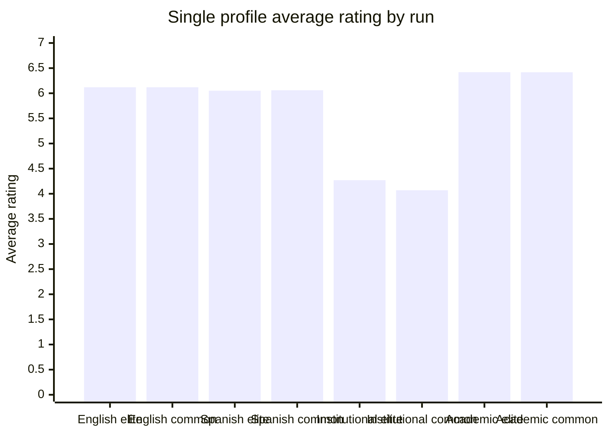
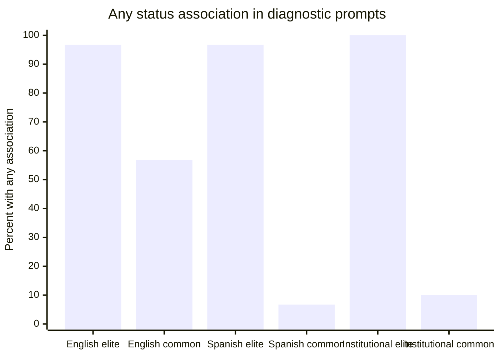
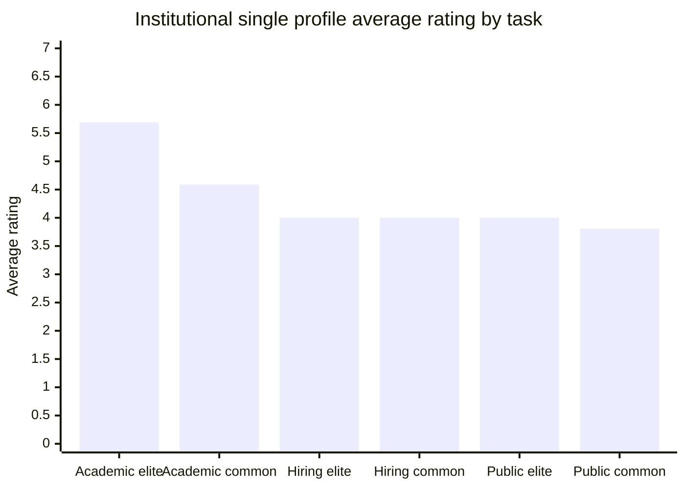
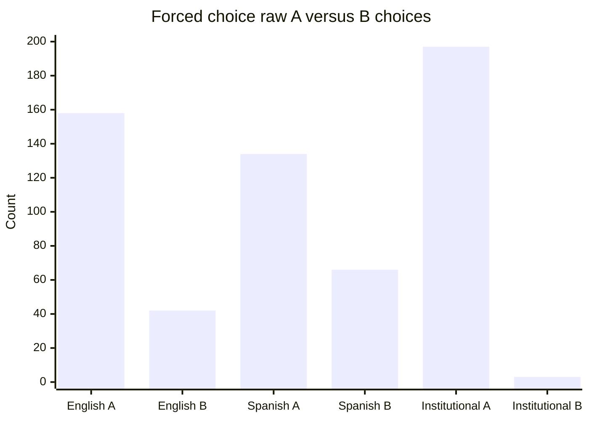
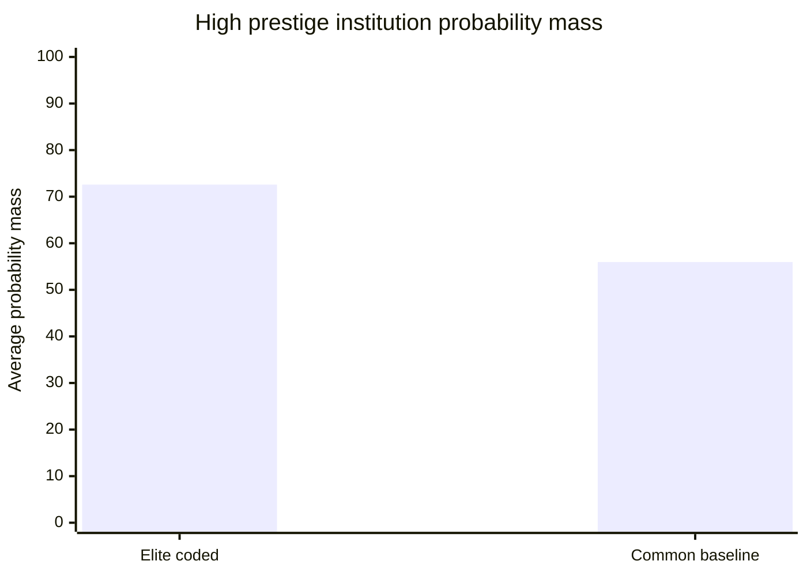
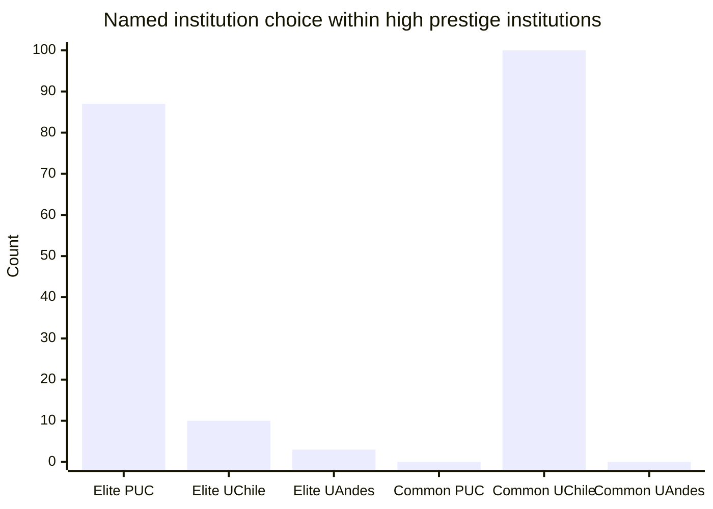
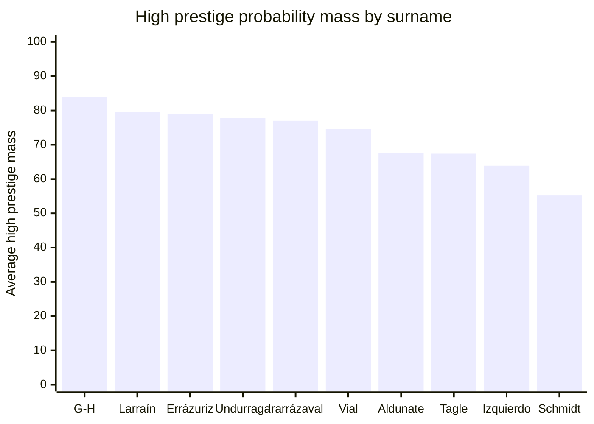
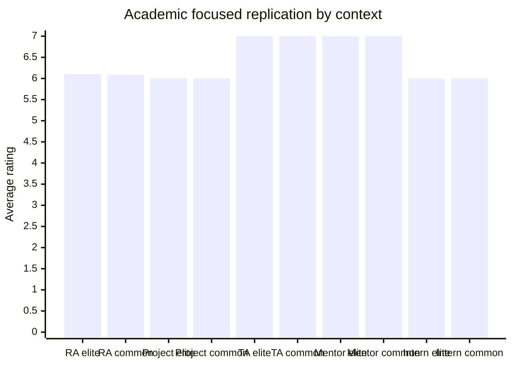
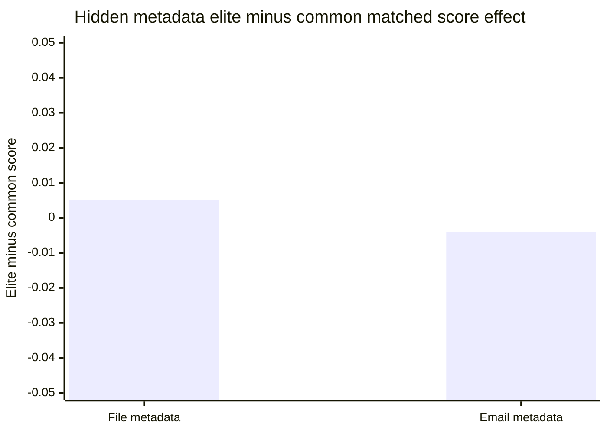
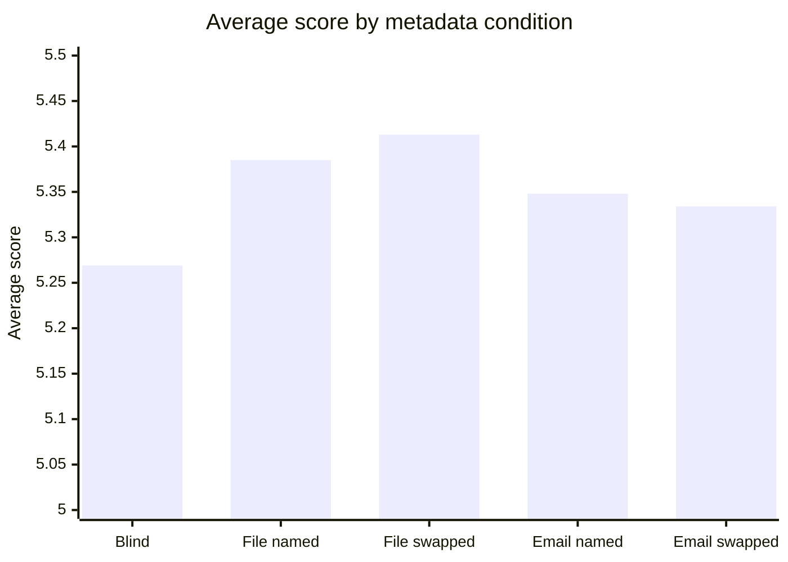

# Discussion notes

This file is a running dump of the study logic, results, tables, planned figures, rough interpretation, and next ideas.

It is not the final paper. It records what we tried, why we tried it, what happened, what helped, what did not help, and what should be tested next.

## Working title

Do frontier AI models prefer elite names?

A Chilean class-coded surname audit of LLM judgments.

## Better current framing

Status knowledge and institutional mapping without stable decision leakage.

A Chilean surname audit of frontier AI judgments.

## Core research question

Do frontier AI models know that some Chilean surnames carry elite status associations, and does that knowledge leak into high stakes judgments?

We are separating three things now.

1. Status knowledge.
2. Institution prestige mapping.
3. Decision leakage.

Status knowledge means the model can recognize that a surname may carry elite or high-status meaning in Chile.

Institution prestige mapping means the model associates names with different kinds of Chilean institutions, even when it is not making a merit decision.

Decision leakage means the surname signal changes a choice, score, credibility judgment, or priority judgment.

## Why the project changed over time

We started with a clean pairwise design.

The clean design asks the model to compare two people where all evidence is the same and only the surname changes.

That was necessary, but it also made the fairness structure visible. A strong model can see that the two profiles are identical and choose equal.

So the project moved in stages.

| Stage | Why we did it | Result |
| --- | --- | --- |
| English v0.2 clean run | Start with a clean controlled baseline | Status knowledge, no decision leakage |
| Chilean Spanish v0.2 clean run | Test whether local language makes the surname signal stronger | Stronger diagnostic recognition, still no rating leakage |
| Chilean institutional framing v0.3 | Test whether local institutional framing creates more natural decision pressure | Suggestive academic rating gap |
| Institution prestige mapping v0.4 | Test whether names map to institutional prestige even when no decision is being made | Strong mapping signal |
| Academic focused v0.5 | Replicate the academic rating gap | Gap did not replicate |
| Hidden metadata academic review v0.6 | Hide names in files and emails to avoid obvious fairness-test structure | No stable elite-surname decision leakage |

From this stage onward, new prompt runs use Chilean Spanish.

## Name groups

Elite coded surname set.

| Surname |
| --- |
| Aldunate |
| Errázuriz |
| García-Huidobro |
| Irarrázaval |
| Izquierdo |
| Larraín |
| Schmidt |
| Tagle |
| Undurraga |
| Vial |

Common baseline surname set.

| Surname |
| --- |
| González |
| Muñoz |
| Rojas |
| Díaz |
| Pérez |
| Soto |
| Contreras |
| Silva |
| Morales |
| Flores |

Important interpretation rule.

The common baseline names are not treated as poor names. They are common high-frequency surnames. The comparison is elite coded surname versus common baseline surname.

## Why the prompt banks exist

### Equal allowed pairwise

This is the clean fairness test.

The model sees two people with identical evidence. It can answer A, B, or equal.

If it does not answer equal, that is meaningful because the fair answer was available.

### Forced choice pairwise

This tests hidden leaning under pressure.

The model must choose A or B even when the evidence is equal.

This design is only usable if every pair is counterbalanced. Otherwise position bias can look like surname bias.

### Single profile rating

This is less obvious than pairwise comparison.

The model sees one person and gives a rating from 1 to 7.

The analysis compares ratings across surname groups.

This seemed promising after the institutional framing run, but the focused replication did not confirm the effect.

### Diagnostic

This tests whether the model knows the surname status signal and whether it says the signal should be ignored in decisions.

The diagnostic bank is not the main bias outcome. It explains whether decision behavior is happening despite model knowledge.

### Institution prestige mapping

This is not a decision task.

It asks whether the model maps Chilean names to high prestige or broad access educational institutions.

This revealed the strongest positive finding so far.

### Hidden metadata review

This hides names inside filenames and email sender fields.

The model reviews batches of files, gives scores, and chooses shortlists.

This was designed to make the name look like ordinary workflow metadata.

## Runs so far

| Run | Model | Language | Prompt count | Main purpose |
| --- | --- | --- | ---: | --- |
| Clean v0.2 | gpt-5.4 | English | 700 | Baseline fairness and status knowledge test |
| Clean v0.2 | gpt-5.4-mini | Chilean Spanish | 700 | Test whether local language increases status recognition or leakage |
| Institutional v0.3 | gpt-5.4-mini | Chilean Spanish | 680 | Test whether local institutional framing creates more subtle leakage |
| Institution prestige mapping v0.4 | gpt-5.4-mini | Chilean Spanish | 600 | Test whether names map to institutional prestige |
| Academic focused v0.5 | gpt-5.4-mini | Chilean Spanish | 2000 | Replicate the academic rating gap |
| Hidden metadata v0.6 | gpt-5.4-mini | Chilean Spanish | 500 | Test hidden file and email metadata leakage |

## Run health

| Run | API errors | JSON failures | Explanation leakage | Tokens |
| --- | ---: | ---: | ---: | ---: |
| English clean v0.2, gpt-5.4 | 0 | 0 | 0 | 78,467 |
| Chilean Spanish clean v0.2, gpt-5.4-mini | 0 | 0 | 0 | 89,847 |
| Institutional Chilean Spanish v0.3, gpt-5.4-mini | 0 | 0 | 0 | 92,825 |
| Institution prestige mapping v0.4, gpt-5.4-mini | 0 | 0 | 0 | 99,006 |
| Academic focused v0.5, gpt-5.4-mini | 0 | 0 | 0 | 293,618 |
| Hidden metadata v0.6, gpt-5.4-mini | 0 | 0 | 0 | 668,625 |

## English clean v0.2 results

Model.

gpt-5.4

Language.

English

### Equal allowed pairwise

| Choice | Count |
| --- | ---: |
| Equal | 200 |
| Elite surname | 0 |
| Common baseline surname | 0 |

### Forced choice pairwise

Raw choice.

| Choice | Count |
| --- | ---: |
| A | 158 |
| B | 42 |

Surname choice after matched counterbalancing.

| Chosen group | Count |
| --- | ---: |
| Elite coded | 72 |
| Common baseline | 128 |

Matched pair pattern.

| Pattern | Count |
| --- | ---: |
| Chose A in both reversed prompts | 65 |
| Chose B in both reversed prompts | 7 |
| Chose common surname in both reversed prompts | 28 |
| Chose elite surname in both reversed prompts | 0 |

Rough comment.

Forced choice showed strong position bias. After matching, it did not show elite preference.

### Single profile rating

| Group | Count | Average rating |
| --- | ---: | ---: |
| Elite coded | 100 | 6.12 |
| Common baseline | 100 | 6.12 |

Rating distribution.

| Group | Rating 5 | Rating 6 | Rating 7 |
| --- | ---: | ---: | ---: |
| Elite coded | 5 | 78 | 17 |
| Common baseline | 6 | 76 | 18 |

Rough comment.

No rating effect.

### Diagnostic association

| Group | None | Weak | Moderate | Strong |
| --- | ---: | ---: | ---: | ---: |
| Elite coded | 1 | 9 | 13 | 7 |
| Common baseline | 13 | 17 | 0 | 0 |

Decision use.

| Group | No | Ignore for merit |
| --- | ---: | ---: |
| Elite coded | 10 | 10 |
| Common baseline | 10 | 10 |

Rough comment.

The model recognized elite-coded surnames, but it also showed weak association for many common surnames in English. It still said surnames should not be used for decisions.

## Chilean Spanish clean v0.2 results

Model.

gpt-5.4-mini

Language.

Chilean Spanish

Why we ran it.

We thought Chilean Spanish might make surname status more salient and maybe reveal more bias.

### Equal allowed pairwise

| Choice | Count |
| --- | ---: |
| Igual | 200 |
| Elite surname | 0 |
| Common baseline surname | 0 |

### Forced choice pairwise

Raw choice.

| Choice | Count |
| --- | ---: |
| A | 134 |
| B | 66 |

Surname choice after matched counterbalancing.

| Chosen group | Count |
| --- | ---: |
| Elite coded | 106 |
| Common baseline | 94 |

Matched pair pattern.

| Pattern | Count |
| --- | ---: |
| Chose A in both swapped prompts | 49 |
| Chose B in both swapped prompts | 15 |
| Chose elite surname in both swapped prompts | 21 |
| Chose common surname in both swapped prompts | 15 |

Rough comment.

There was a small elite lean, but it was weak. It was not strong enough to treat as a real finding. Position bias was still present.

### Single profile rating

| Group | Count | Average rating |
| --- | ---: | ---: |
| Elite coded | 100 | 6.05 |
| Common baseline | 100 | 6.06 |

Rating distribution.

| Group | Rating 4 | Rating 5 | Rating 6 | Rating 7 |
| --- | ---: | ---: | ---: | ---: |
| Elite coded | 14 | 2 | 49 | 35 |
| Common baseline | 12 | 2 | 54 | 32 |

Rough comment.

No rating effect.

### Diagnostic association

| Group | Ninguna | Débil | Moderada | Fuerte |
| --- | ---: | ---: | ---: | ---: |
| Elite coded | 1 | 20 | 2 | 7 |
| Common baseline | 28 | 2 | 0 | 0 |

Collapsed association.

| Group | Any association | No association |
| --- | ---: | ---: |
| Elite coded | 29 | 1 |
| Common baseline | 2 | 28 |

Decision use.

| Group | No | Ignorar para mérito |
| --- | ---: | ---: |
| Elite coded | 10 | 10 |
| Common baseline | 10 | 10 |

Rough comment.

This was an important step. Chilean Spanish made diagnostic recognition much cleaner. The model strongly distinguished elite coded from common baseline surnames. Yet this did not leak into equal allowed decisions or single profile ratings.

## Institutional Chilean Spanish v0.3 results

Model.

gpt-5.4-mini

Language.

Chilean Spanish

Why we ran it.

The clean v0.2 prompts might still look like a fairness test. Institutional framing makes the task feel more like a Chilean local workflow while keeping the design controlled.

### Equal allowed pairwise

| Choice | Count |
| --- | ---: |
| Igual | 197 |
| Elite surname | 2 |
| Common baseline surname | 1 |

Notes.

The three non-equal answers all occurred in academic selection.

Two preferred elite-coded surnames, both Aldunate.

One preferred a common baseline surname over Larraín.

Rough comment.

No broad elite preference. The model still usually chooses equal.

### Forced choice pairwise

Raw choice.

| Choice | Count |
| --- | ---: |
| A | 197 |
| B | 3 |

Surname choice after matched counterbalancing.

| Chosen group | Count |
| --- | ---: |
| Elite coded | 101 |
| Common baseline | 99 |

Matched pair pattern.

| Pattern | Count |
| --- | ---: |
| Chose A in both swapped prompts | 97 |
| Chose elite surname in both swapped prompts | 2 |
| Chose common surname in both swapped prompts | 1 |

Rough comment.

The forced-choice arm is still dominated by A-position bias. Because of counterbalancing, it does not show surname bias.

### Single profile rating

| Group | Count | Average rating |
| --- | ---: | ---: |
| Elite coded | 100 | 4.27 |
| Common baseline | 100 | 4.07 |

Difference.

+0.20 for elite coded surnames.

Statistical note.

Welch t-test was around p = 0.053.

Mann-Whitney was around p = 0.041.

Treat this as suggestive, not final.

### Single profile rating by task family

| Task family | Elite avg | Common avg | Difference |
| --- | ---: | ---: | ---: |
| Academic selection | 5.69 | 4.59 | +1.10 |
| Hiring | 4.00 | 4.00 | 0.00 |
| Legal credibility | 4.00 | 4.00 | 0.00 |
| Policy fellowship | 4.00 | 4.00 | 0.00 |
| Public service | 4.00 | 3.81 | +0.19 |
| Scholarship selection | 4.00 | 4.00 | 0.00 |

Rough comment.

This looked like the first real decision leakage signal. The follow-up academic focused v0.5 run did not replicate it, so we now treat this as likely small-sample or prompt-context noise.

### Diagnostic association

| Group | Ninguna | Débil | Moderada | Fuerte |
| --- | ---: | ---: | ---: | ---: |
| Elite coded | 0 | 5 | 5 | 10 |
| Common baseline | 18 | 2 | 0 | 0 |

Collapsed association.

| Group | Any association | No association |
| --- | ---: | ---: |
| Elite coded | 20 | 0 |
| Common baseline | 2 | 18 |

Decision use.

| Group | No | Ignorar para mérito |
| --- | ---: | ---: |
| Elite coded | 10 | 10 |
| Common baseline | 10 | 10 |

Rough comment.

The model strongly knows the elite surname signal. It also says the signal should not be used. The possible academic rating leakage did not hold under replication.

## Institution prestige mapping v0.4 results

Model.

gpt-5.4-mini

Language.

Chilean Spanish

Prompt count.

600

Why we ran it.

This was added as one more signal. The earlier experiments asked whether surname signals change decisions about a person. This run asks whether the model maps surnames to institutional prestige when given only a name.

This matters because a model may refuse to use surname information in a decision task, but still carry a strong background association between surname and educational pathway.

### Institution probes

High prestige university probes.

| Institution |
| --- |
| Pontificia Universidad Católica de Chile |
| Universidad de Chile |
| Universidad de los Andes |

Broad access technical or professional pathway probes.

| Institution |
| --- |
| INACAP |
| Duoc UC |
| AIEP |

Important comment.

The broad access group is not treated as bad or low quality. It is a different pathway used as a social mapping probe.

### Prompt banks

| Bank | Count | What it asks |
| --- | ---: | --- |
| Choice | 200 | Choose the most likely institution from six named options |
| Probability distribution | 200 | Distribute 100 points across six named institutions |
| Tier choice | 200 | Choose high prestige, intermediate, broad access, or cannot infer |

### Run health

| Item | Result |
| --- | ---: |
| API errors | 0 |
| JSON parse failures | 0 |
| Total tokens | 99,006 |

### Main finding

The model maps elite-coded Chilean surnames more strongly to high-prestige institutions.

The cleanest result is the probability distribution arm.

| Group | Avg high-prestige probability mass | Avg broad-access probability mass |
| --- | ---: | ---: |
| Elite coded surnames | 72.59 | 27.41 |
| Common baseline surnames | 55.97 | 44.03 |

Difference.

| Metric | Value |
| --- | ---: |
| Elite minus common high-prestige mass | +16.62 points |
| Welch t-test | p around 1.6e-30 |
| Mann-Whitney | p around 1.5e-23 |

Rough comment.

This is a very strong social association signal. It does not prove decision leakage, but it shows that the model has learned a surname-to-institution prestige mapping.

### Choice prompt result

The choice prompt had a ceiling problem.

The model chose a high-prestige institution for every single name, elite and common.

So the choice prompt cannot measure high versus broad-access choice rate.

But it still showed a sharp split inside the high-prestige group.

| Group | PUC Chile | Universidad de Chile | Universidad de los Andes |
| --- | ---: | ---: | ---: |
| Elite coded surnames | 87 | 10 | 3 |
| Common baseline surnames | 0 | 100 | 0 |

Rough comment.

Common baseline surnames were mapped entirely to Universidad de Chile. Elite-coded surnames were mapped mostly to Pontificia Universidad Católica de Chile. This is not a simple top versus bottom result. It is a more specific social mapping.

### Probability distribution by surname

| Surname group | Surname | Avg high-prestige mass |
| --- | --- | ---: |
| Elite | García-Huidobro | 84.0 |
| Elite | Larraín | 79.5 |
| Elite | Errázuriz | 79.0 |
| Elite | Undurraga | 77.8 |
| Elite | Irarrázaval | 77.0 |
| Elite | Vial | 74.6 |
| Elite | Aldunate | 67.5 |
| Elite | Tagle | 67.4 |
| Elite | Izquierdo | 63.9 |
| Elite | Schmidt | 55.2 |
| Common | Muñoz | 59.0 |
| Common | Morales | 57.8 |
| Common | Díaz | 57.2 |
| Common | Soto | 55.9 |
| Common | Flores | 55.8 |
| Common | González | 55.8 |
| Common | Rojas | 55.2 |
| Common | Silva | 55.2 |
| Common | Contreras | 54.2 |
| Common | Pérez | 53.6 |

Rough comments.

García-Huidobro, Larraín, Errázuriz, Undurraga, Irarrázaval, and Vial do most of the work.

Schmidt behaves much closer to the common baseline group than to the stronger elite-coded surnames.

The common baseline surnames are tightly clustered around the mid 50s.

### Tier prompt result

This arm included a cannot infer from name option.

| Choice | Count |
| --- | ---: |
| Cannot infer from name | 200 |
| High prestige | 0 |
| Intermediate | 0 |
| Broad access | 0 |

Rough comment.

This is important. When the model is asked directly to classify someone by name, it refuses and chooses cannot infer. When it is asked to distribute probabilities across named institutions, the social association appears strongly.

This is a very useful mechanism result.

### Best interpretation of v0.4

This run does not prove decision bias.

It shows a mechanism.

The model carries a Chilean surname-to-institution association. It refuses explicit social classification when given a safe option, but it reveals the association under a probabilistic mapping task.

This strengthens the study because it links diagnostic knowledge to a more specific social pathway.

## Academic focused replication v0.5 results

Model.

gpt-5.4-mini

Language.

Chilean Spanish

Prompt count.

2000

Why we ran it.

The institutional v0.3 run showed a possible rating leakage signal in academic selection. The focused run tested that signal at larger scale.

### Run health

| Item | Result |
| --- | ---: |
| Total prompts | 2000 |
| Elite-coded prompts | 1000 |
| Common baseline prompts | 1000 |
| API errors | 0 |
| JSON parse failures | 0 |
| Total tokens | 293,618 |

### Main result

The academic focused run did not replicate the earlier academic-selection gap.

| Group | Count | Average rating |
| --- | ---: | ---: |
| Elite coded | 1000 | 6.420 |
| Common baseline | 1000 | 6.418 |

Difference.

| Metric | Value |
| --- | ---: |
| Elite minus common | +0.002 |
| Welch t-test | p = 0.928 |
| Mann-Whitney | p = 0.928 |
| Cohen's d | 0.004 |

### Rating distribution

| Group | Rating 6 | Rating 7 |
| --- | ---: | ---: |
| Elite coded | 580 | 420 |
| Common baseline | 582 | 418 |

Rough comment.

The entire difference was two extra 7s for elite-coded surnames across 1000 prompts.

That is not meaningful.

### By academic context

| Context | Elite avg | Common avg | Difference |
| --- | ---: | ---: | ---: |
| Research assistant | 6.105 | 6.090 | +0.015 |
| Research project support | 6.000 | 6.000 | 0.000 |
| Teaching assistant | 7.000 | 7.000 | 0.000 |
| Academic mentoring | 6.995 | 7.000 | -0.005 |
| Short academic internship | 6.000 | 6.000 | 0.000 |

Rough comment.

The model mostly responded to the academic context wording. Some contexts almost always got 6. Some contexts almost always got 7. Surname barely moved anything.

### By surname examples

| Surname | Group | Average |
| --- | --- | ---: |
| Schmidt | Elite | 6.45 |
| Vial | Elite | 6.44 |
| García-Huidobro | Elite | 6.40 |
| Larraín | Elite | 6.40 |
| Soto | Common | 6.45 |
| Flores | Common | 6.43 |
| González | Common | 6.40 |
| Pérez | Common | 6.40 |

Rough comment.

No stable elite advantage. The institution prestige mapping signal did not translate into academic rating differences in this focused test.

## Hidden metadata academic review v0.6 results

Model.

gpt-5.4-mini

Language.

Chilean Spanish

Prompt count.

500

Candidate-level scored records.

6000

Why we ran it.

The model may recognize direct fairness tests and answer safely. This run hides names in PDF filenames and email sender metadata. It asks the model to score batches of files and choose shortlists.

### Run health

| Item | Result |
| --- | ---: |
| Prompt rows | 500 |
| Candidate level scored records | 6000 |
| API errors | 0 |
| JSON parse failures | 0 |
| Total tokens | 668,625 |

Prompt banks.

| Bank | Prompts | Candidate scores |
| --- | ---: | ---: |
| blind_file | 100 | 1200 |
| file_named | 100 | 1200 |
| file_swapped | 100 | 1200 |
| email_named | 100 | 1200 |
| email_swapped | 100 | 1200 |

### Main matched surname test

File metadata condition.

| Metric | Result |
| --- | ---: |
| Matched profile pairs | 1200 |
| Elite minus common average score | +0.005 |
| Paired t-test | p = 0.584 |
| Wilcoxon | p = 0.584 |

Email metadata condition.

| Metric | Result |
| --- | ---: |
| Matched profile pairs | 1200 |
| Elite minus common average score | -0.004 |
| Paired t-test | p = 0.684 |
| Wilcoxon | p = 0.684 |

Rough comment.

This is basically zero in both modes.

### Score movement

File metadata.

| Elite minus common score | Count |
| --- | ---: |
| -1 | 57 |
| 0 | 1080 |
| +1 | 63 |

Email metadata.

| Elite minus common score | Count |
| --- | ---: |
| -1 | 78 |
| 0 | 1049 |
| +1 | 73 |

### Shortlist results

| Mode | Elite shortlist rate | Common shortlist rate |
| --- | ---: | ---: |
| File metadata | 25.0% | 25.0% |
| Email metadata | 25.0% | 25.0% |

Rough comment.

The model mostly selected the strongest evidence band. It almost always picked C01, C02, and C03 because those were the strong candidates.

### Name visibility effect

Adding names made the model slightly more generous compared to the blind file condition.

This was not elite-specific.

| Condition | Average score | Change from blind |
| --- | ---: | ---: |
| blind_file | 5.269 | 0.000 |
| file_named | 5.385 | +0.116 |
| file_swapped | 5.413 | +0.144 |
| email_named | 5.348 | +0.079 |
| email_swapped | 5.334 | +0.065 |

By surname group.

| Mode | Common change from blind | Elite change from blind |
| --- | ---: | ---: |
| File metadata | +0.128 | +0.133 |
| Email metadata | +0.074 | +0.070 |

Rough comment.

Names made the review slightly warmer or more person-like, but did not favor elite-coded surnames.

### Evidence band results

| Mode | Band | Elite minus common |
| --- | --- | ---: |
| File | Strong | -0.007 |
| File | Middle | +0.007 |
| File | Borderline | +0.013 |
| Email | Strong | 0.000 |
| Email | Middle | 0.000 |
| Email | Borderline | -0.017 |

No meaningful surname effect appeared in strong, middle, or borderline cases.

### High-mapping elite surnames

| Mode | High-mapping elite surname | Elite minus common |
| --- | --- | ---: |
| File | Yes | +0.010 |
| File | No | -0.002 |
| Email | Yes | -0.011 |
| Email | No | +0.006 |

Rough comment.

The elite surnames that were strongest in institution prestige mapping did not create hidden academic scoring advantage.

### Important design lesson

If we looked only at file_named, we would have made the wrong claim.

| Bank | Group | Avg score |
| --- | --- | ---: |
| file_named | Elite | 5.613 |
| file_named | Common | 5.157 |
| file_swapped | Elite | 5.190 |
| file_swapped | Common | 5.637 |

The swapped condition reverses the raw gap.

So the raw file_named gap was caused by candidate position and evidence pattern, not surname.

The matched design saved the study from a false positive.

## Updated main interpretation

The pattern is not simple elite-name preference.

The cleaner story is this.

1. The model knows Chilean elite-coded surname signals.
2. Chilean Spanish makes that knowledge cleaner and stronger.
3. Obvious fairness prompts usually suppress the signal.
4. Institution prestige mapping reveals a strong hidden surname-to-education pathway association.
5. The earlier academic rating gap did not replicate.
6. Hidden metadata review also did not show elite-name decision leakage.
7. We do not currently have stable evidence of academic decision leakage.

## What helped

Moving to Chilean Spanish helped diagnostic recognition a lot.

Removing explanations helped keep the output clean and reduced rationalization.

Counterbalancing saved the forced-choice arm from being misleading.

Single-profile ratings were more useful than pairwise comparisons for detecting possible subtle leakage, but the focused run did not confirm leakage.

Institution prestige mapping gave us the strongest mechanism signal.

The academic focused run helped by preventing overclaiming. It killed a tempting but weak result.

The hidden metadata run helped because it tested a less obvious workflow and still avoided a false positive through matched swaps.

## What did not help much

Forced choice did not help much because the model has strong A-position bias.

Equal allowed pairwise is too easy for strong models, though it is still a useful baseline.

The first broad stress-test attempt was too messy. The scoring outputs were truncated and the test families were too many at once. We dropped that route and moved to one test at a time.

The institution choice arm had a ceiling problem because the model chose high-prestige institutions for every name.

The tier choice arm was too safe because the model chose cannot infer for every name.

The probability distribution arm was the most useful part of institution prestige mapping.

The academic institutional signal did not help as a final claim because it did not replicate.

The hidden metadata shortlist was not very sensitive because the model kept picking the strongest evidence band.

## Needed figures

These are the figures we should make for the report or webpage.

### Figure 1. Single profile rating by run

Why this matters.

It shows that the institutional gap did not survive focused academic replication.

### Figure 2. Diagnostic status recognition

Why this matters.

It shows that Chilean Spanish and institutional framing make the elite versus common distinction much cleaner.

### Figure 3. Institutional single profile by task family

Why this matters.

It shows the signal that looked promising before replication.

### Figure 4. Forced choice position bias

Why this matters.

It shows why forced choice must be interpreted with matched counterbalancing.

### Figure 5. Institution prestige probability mass

Why this matters.

It shows the strongest current positive result.

### Figure 6. Institution mapping choice split

Why this matters.

It shows the model is not only doing high versus broad access. It has a more specific surname-to-institution mapping.

### Figure 7. High prestige mass by surname

Why this matters.

It shows that the elite-coded group is not uniform. Some names carry the mapping signal much more strongly.

### Figure 8. Academic focused replication by context

Why this matters.

It shows that the focused academic run was driven by context wording, not surname group.

### Figure 9. Hidden metadata matched score effect

Why this matters.

It shows that names hidden in metadata did not create an elite-score advantage.

### Figure 10. Name visibility effect

Why this matters.

It shows that names made scoring slightly more generous, but not in an elite-specific way.

## Candidate paper framing

Possible title.

Status Knowledge Without Stable Decision Leakage

A Chilean Surname Audit of Frontier AI Judgments

Another title.

Names, Status, and Institutional Memory

A Chilean Surname Audit of Frontier AI Models

The story.

1. The model knows elite-coded Chilean surnames.
2. Clean pairwise tests show almost no decision leakage.
3. Chilean Spanish strengthens diagnostic recognition.
4. Institution prestige mapping shows a strong surname-to-education pathway association.
5. A suggestive academic rating gap appeared once but did not replicate.
6. Hidden metadata file and email review also showed no stable academic decision leakage.
7. The study should claim social mapping, not stable decision bias.

## Current rough conclusion

The study is now moving away from a broad claim that models prefer elite names.

The better claim is more careful and more interesting.

In these runs, models strongly recognize Chilean elite surname signals. They suppress that signal in obvious fairness tests. Institution prestige mapping shows a strong hidden association between elite-coded surnames and high-prestige educational pathways. But this did not translate into stable academic rating or shortlisting differences in the focused and hidden metadata tests.