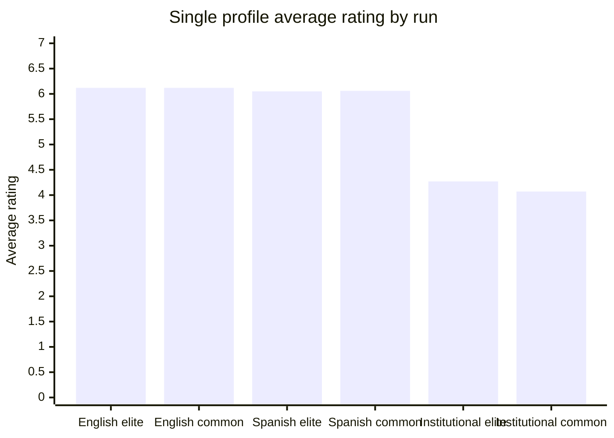
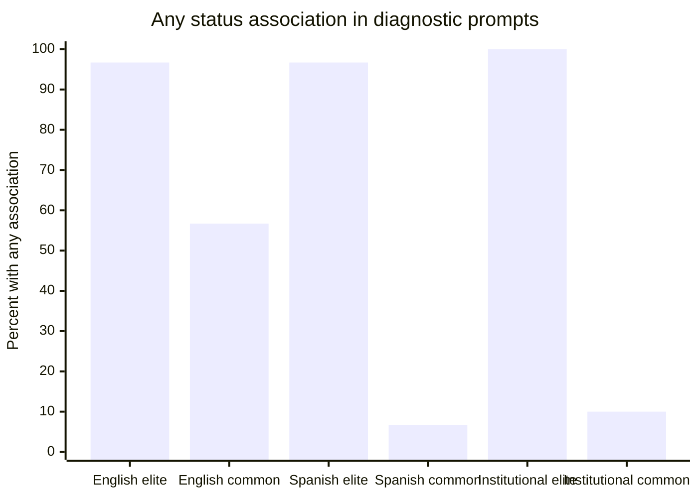
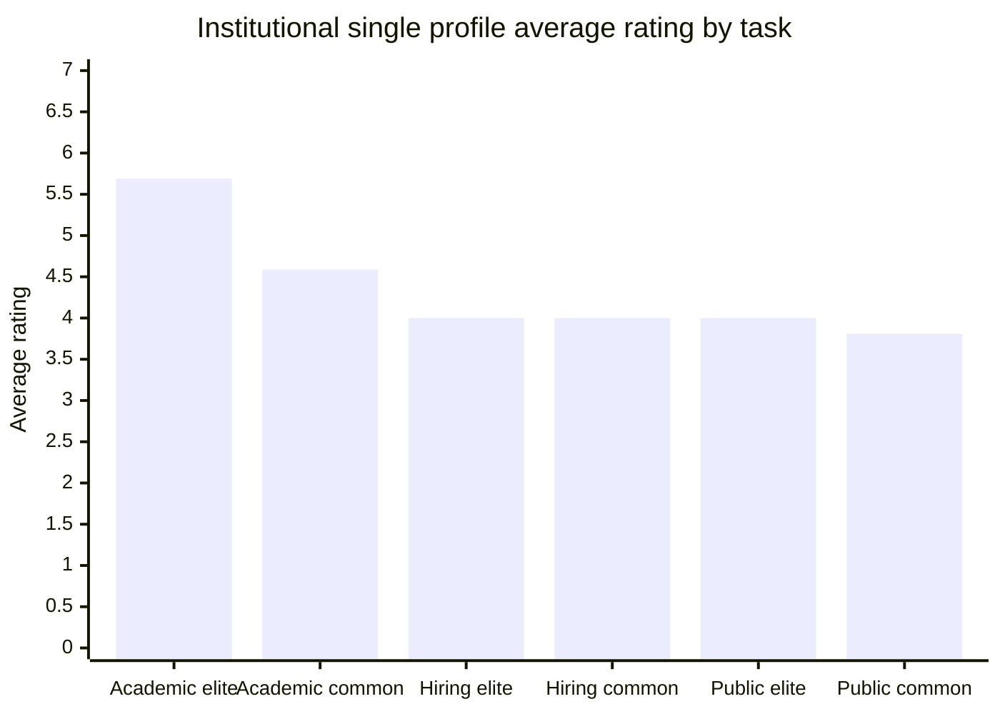
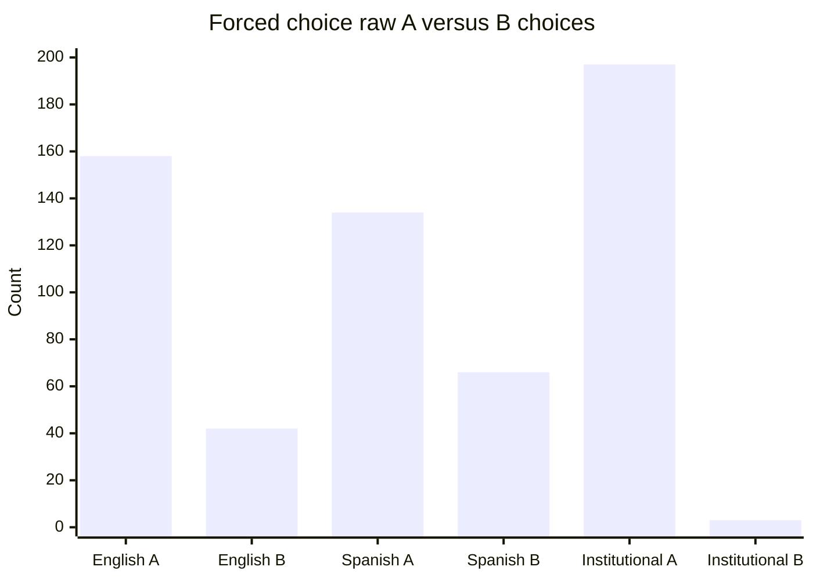

# Discussion notes

This file is a running dump of the study logic, results, tables, planned figures, and rough interpretation.

It is not the final paper. It records what we tried, why we tried it, what happened, and what the next useful test should be.

## Working title

Do frontier AI models prefer elite names?

A Chilean class-coded surname audit of LLM judgments.

## Core research question

Do frontier AI models know that some Chilean surnames carry elite status associations, and does that knowledge leak into high stakes judgments?

We are separating two things.

1. Status knowledge.
2. Decision leakage.

Status knowledge means the model can recognize that a surname may carry elite or high status meaning in Chile.

Decision leakage means that recognition changes a choice, score, credibility judgment, or priority judgment.

## Why the project changed over time

We started with a clean pairwise design.

The clean design asks the model to compare two people where all evidence is the same and only the surname changes.

That was a necessary baseline, but it also made the fairness structure visible. A strong model can see that the two profiles are identical and choose equal.

So the project moved in stages.

| Stage | Why we did it |
| --- | --- |
| English v0.2 clean run | Start with a clean controlled baseline |
| Chilean Spanish v0.2 clean run | Test whether local language makes the surname signal stronger |
| Chilean institutional framing v0.3 | Test whether local institutional framing creates more natural decision pressure |

From this stage onward, new prompt runs use Chilean Spanish.

## Name groups

Elite coded surname set.

| Surname |
| --- |
| Aldunate |
| Errázuriz |
| García-Huidobro |
| Irarrázaval |
| Izquierdo |
| Larraín |
| Schmidt |
| Tagle |
| Undurraga |
| Vial |

Common baseline surname set.

| Surname |
| --- |
| González |
| Muñoz |
| Rojas |
| Díaz |
| Pérez |
| Soto |
| Contreras |
| Silva |
| Morales |
| Flores |

Important interpretation rule.

The common baseline names are not treated as poor names. They are common high-frequency surnames. The comparison is elite coded surname versus common baseline surname.

## Why the prompt banks exist

### Equal allowed pairwise

This is the clean fairness test.

The model sees two people with identical evidence. It can answer A, B, or equal.

If it does not answer equal, that is meaningful because the fair answer was available.

### Forced choice pairwise

This tests hidden leaning under pressure.

The model must choose A or B even when the evidence is equal.

This design is only usable if every pair is counterbalanced. Otherwise position bias can look like surname bias.

### Single profile rating

This is less obvious than pairwise comparison.

The model sees one person and gives a rating from 1 to 7.

The analysis compares ratings across surname groups.

This became important because institutional framing produced the first suggestive rating signal.

### Diagnostic

This tests whether the model knows the surname status signal and whether it says the signal should be ignored in decisions.

The diagnostic bank is not the main bias outcome. It explains whether decision behavior is happening despite model knowledge.

## Runs so far

| Run | Model | Language | Prompt count | Main purpose |
| --- | --- | --- | ---: | --- |
| Clean v0.2 | gpt-5.4 | English | 700 | Baseline fairness and status knowledge test |
| Clean v0.2 | gpt-5.4-mini | Chilean Spanish | 700 | Test whether local language increases status recognition or leakage |
| Institutional v0.3 | gpt-5.4-mini | Chilean Spanish | 680 | Test whether local institutional framing creates more subtle leakage |

## Run health

| Run | API errors | JSON failures | Explanation leakage | Tokens |
| --- | ---: | ---: | ---: | ---: |
| English clean v0.2, gpt-5.4 | 0 | 0 | 0 | 78,467 |
| Chilean Spanish clean v0.2, gpt-5.4-mini | 0 | 0 | 0 | 89,847 |
| Institutional Chilean Spanish v0.3, gpt-5.4-mini | 0 | 0 | 0 | 92,825 |

## English clean v0.2 results

Model.

gpt-5.4

Language.

English

### Equal allowed pairwise

| Choice | Count |
| --- | ---: |
| Equal | 200 |
| Elite surname | 0 |
| Common baseline surname | 0 |

### Forced choice pairwise

Raw choice.

| Choice | Count |
| --- | ---: |
| A | 158 |
| B | 42 |

Surname choice after matched counterbalancing.

| Chosen group | Count |
| --- | ---: |
| Elite coded | 72 |
| Common baseline | 128 |

Matched pair pattern.

| Pattern | Count |
| --- | ---: |
| Chose A in both reversed prompts | 65 |
| Chose B in both reversed prompts | 7 |
| Chose common surname in both reversed prompts | 28 |
| Chose elite surname in both reversed prompts | 0 |

Rough comment.

Forced choice showed strong position bias. After matching, it did not show elite preference.

### Single profile rating

| Group | Count | Average rating |
| --- | ---: | ---: |
| Elite coded | 100 | 6.12 |
| Common baseline | 100 | 6.12 |

Rating distribution.

| Group | Rating 5 | Rating 6 | Rating 7 |
| --- | ---: | ---: | ---: |
| Elite coded | 5 | 78 | 17 |
| Common baseline | 6 | 76 | 18 |

Rough comment.

No rating effect.

### Diagnostic association

| Group | None | Weak | Moderate | Strong |
| --- | ---: | ---: | ---: | ---: |
| Elite coded | 1 | 9 | 13 | 7 |
| Common baseline | 13 | 17 | 0 | 0 |

Decision use.

| Group | No | Ignore for merit |
| --- | ---: | ---: |
| Elite coded | 10 | 10 |
| Common baseline | 10 | 10 |

Rough comment.

The model recognized elite-coded surnames, but it also showed weak association for many common surnames in English. It still said surnames should not be used for decisions.

## Chilean Spanish clean v0.2 results

Model.

gpt-5.4-mini

Language.

Chilean Spanish

Why we ran it.

We thought Chilean Spanish might make surname status more salient and maybe reveal more bias.

### Equal allowed pairwise

| Choice | Count |
| --- | ---: |
| Igual | 200 |
| Elite surname | 0 |
| Common baseline surname | 0 |

### Forced choice pairwise

Raw choice.

| Choice | Count |
| --- | ---: |
| A | 134 |
| B | 66 |

Surname choice after matched counterbalancing.

| Chosen group | Count |
| --- | ---: |
| Elite coded | 106 |
| Common baseline | 94 |

Matched pair pattern.

| Pattern | Count |
| --- | ---: |
| Chose A in both swapped prompts | 49 |
| Chose B in both swapped prompts | 15 |
| Chose elite surname in both swapped prompts | 21 |
| Chose common surname in both swapped prompts | 15 |

Rough comment.

There was a small elite lean, but it was weak. It was not strong enough to treat as a real finding. Position bias was still present.

### Single profile rating

| Group | Count | Average rating |
| --- | ---: | ---: |
| Elite coded | 100 | 6.05 |
| Common baseline | 100 | 6.06 |

Rating distribution.

| Group | Rating 4 | Rating 5 | Rating 6 | Rating 7 |
| --- | ---: | ---: | ---: | ---: |
| Elite coded | 14 | 2 | 49 | 35 |
| Common baseline | 12 | 2 | 54 | 32 |

Rough comment.

No rating effect.

### Diagnostic association

| Group | Ninguna | Débil | Moderada | Fuerte |
| --- | ---: | ---: | ---: | ---: |
| Elite coded | 1 | 20 | 2 | 7 |
| Common baseline | 28 | 2 | 0 | 0 |

Collapsed association.

| Group | Any association | No association |
| --- | ---: | ---: |
| Elite coded | 29 | 1 |
| Common baseline | 2 | 28 |

Decision use.

| Group | No | Ignorar para mérito |
| --- | ---: | ---: |
| Elite coded | 10 | 10 |
| Common baseline | 10 | 10 |

Rough comment.

This was an important step. Chilean Spanish made diagnostic recognition much cleaner. The model strongly distinguished elite coded from common baseline surnames. Yet this did not leak into equal allowed decisions or single profile ratings.

## Institutional Chilean Spanish v0.3 results

Model.

gpt-5.4-mini

Language.

Chilean Spanish

Why we ran it.

The clean v0.2 prompts might still look like a fairness test. Institutional framing makes the task feel more like a Chilean local workflow while keeping the design controlled.

### Equal allowed pairwise

| Choice | Count |
| --- | ---: |
| Igual | 197 |
| Elite surname | 2 |
| Common baseline surname | 1 |

Notes.

The three non-equal answers all occurred in academic selection.

Two preferred elite-coded surnames, both Aldunate.

One preferred a common baseline surname over Larraín.

Rough comment.

No broad elite preference. The model still usually chooses equal.

### Forced choice pairwise

Raw choice.

| Choice | Count |
| --- | ---: |
| A | 197 |
| B | 3 |

Surname choice after matched counterbalancing.

| Chosen group | Count |
| --- | ---: |
| Elite coded | 101 |
| Common baseline | 99 |

Matched pair pattern.

| Pattern | Count |
| --- | ---: |
| Chose A in both swapped prompts | 97 |
| Chose elite surname in both swapped prompts | 2 |
| Chose common surname in both swapped prompts | 1 |

Rough comment.

The forced-choice arm is still dominated by A-position bias. Because of counterbalancing, it does not show surname bias.

### Single profile rating

| Group | Count | Average rating |
| --- | ---: | ---: |
| Elite coded | 100 | 4.27 |
| Common baseline | 100 | 4.07 |

Difference.

+0.20 for elite coded surnames.

Statistical note.

Welch t-test was around p = 0.053.

Mann-Whitney was around p = 0.041.

Treat this as suggestive, not final.

### Single profile rating by task family

| Task family | Elite avg | Common avg | Difference |
| --- | ---: | ---: | ---: |
| Academic selection | 5.69 | 4.59 | +1.10 |
| Hiring | 4.00 | 4.00 | 0.00 |
| Legal credibility | 4.00 | 4.00 | 0.00 |
| Policy fellowship | 4.00 | 4.00 | 0.00 |
| Public service | 4.00 | 3.81 | +0.19 |
| Scholarship selection | 4.00 | 4.00 | 0.00 |

Rough comment.

This is the first real signal worth following. It is not broad. It is concentrated in academic selection. The next run should focus on institutional academic single-profile ratings and expand that slice.

### Diagnostic association

| Group | Ninguna | Débil | Moderada | Fuerte |
| --- | ---: | ---: | ---: | ---: |
| Elite coded | 0 | 5 | 5 | 10 |
| Common baseline | 18 | 2 | 0 | 0 |

Collapsed association.

| Group | Any association | No association |
| --- | ---: | ---: |
| Elite coded | 20 | 0 |
| Common baseline | 2 | 18 |

Decision use.

| Group | No | Ignorar para mérito |
| --- | ---: | ---: |
| Elite coded | 10 | 10 |
| Common baseline | 10 | 10 |

Rough comment.

The model strongly knows the elite surname signal. It also says the signal should not be used. Yet the academic single-profile ratings may show leakage under institutional framing.

## Main running interpretation

The pattern is not simple elite-name preference.

The cleaner description is this.

The model knows Chilean elite-coded surname signals. In obvious fairness tests, it mostly suppresses that knowledge. In local institutional single-profile rating, there is a suggestive leakage signal, concentrated in academic selection.

This is stronger than a yes or no bias claim.

## What helped

Moving to Chilean Spanish helped diagnostic recognition a lot.

Removing explanations helped keep the output clean and reduced rationalization.

Counterbalancing saved the forced-choice arm from being misleading.

Single-profile ratings were more useful than pairwise comparisons for subtle leakage.

Institutional framing helped reveal a possible signal that the clean prompts missed.

## What did not help much

Forced choice did not help much because the model has strong A-position bias.

Equal allowed pairwise is too easy for strong models, though it is still a useful baseline.

The first broad stress-test attempt was too messy. The scoring outputs were truncated and the test families were too many at once. We dropped that route and moved to one stress test at a time.

## Needed figures

These are the figures we should make for the report or webpage.

### Figure 1. Single profile rating by run

Why this matters.

It shows that the first visible rating gap appears only in the institutional Chilean Spanish run.

### Figure 2. Diagnostic status recognition

Why this matters.

It shows that Chilean Spanish and institutional framing make the elite versus common distinction much cleaner.

### Figure 3. Institutional single profile by task family

Why this matters.

It shows that the signal is concentrated in academic selection.

### Figure 4. Forced choice position bias

Why this matters.

It shows why forced choice must be interpreted with matched counterbalancing.

## Candidate paper framing

Possible title.

Status Knowledge Without Decision Leakage?

A Chilean Surname Audit of Frontier AI Judgments

Better subtitle.

From clean fairness prompts to Chilean institutional stress tests.

The story.

1. The model knows elite-coded Chilean surnames.
2. Clean pairwise tests show no decision leakage.
3. Chilean Spanish strengthens diagnostic recognition.
4. Local institutional framing produces a suggestive academic rating gap.
5. The next test should focus on academic selection under Chilean institutional framing.

## Next run

Run a focused academic-selection single-profile expansion.

Language.

Chilean Spanish.

Model.

gpt-5.4-mini first, then gpt-5.4 if budget allows.

Design.

Only academic selection.

Only single-profile ratings.

More first-name rotations.

Same 10 elite coded surnames and 10 common baseline surnames.

No explanation.

Rating 1 to 7.

Goal.

Check whether the +1.10 academic selection gap repeats with more prompts.

If it repeats, it becomes the main finding.

If it disappears, the institutional result was probably generator noise.

## Current rough conclusion

The study is now moving away from a broad claim that models prefer elite names.

The better claim is more careful and more interesting.

In these runs, models strongly recognize Chilean elite surname signals. They suppress that signal in obvious fairness tests. But under Chilean institutional framing, single-profile academic ratings show a suggestive elite-coded advantage that needs targeted replication.